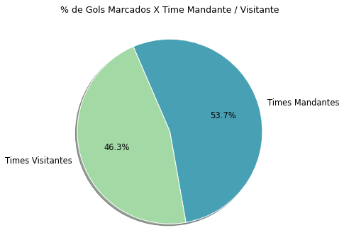

# Premier League 2021-2022 (EDA)

A Premier League é um torneio de futebol originário da Inglaterra, e tal torneio é considerado como um dos campeonatos mais reconhecíveis e aclamados pela crítica, justamente por ser um dos campeonatos de maior qualidade futebolística e competitiva. 

Neste projeto analítico, apresento em minúcias uma análise exploratória concernente à Premier League da edição mais recente de 2021-2022, em tal exame, responderei diversas questões que exponham vários insights informacionais relevantes e nevrálgicos em relação à última edição de tal campeonato.


## Importação de bibliotecas:

Às bibliotecas importadas para essa análise foram Pandas, Numpy, Matplotlib e Seaborn, Pandas e Numpy são bibliotecas que fornecem funções tabulares que facilitam na manipulação dos dados, já Matplotlib e Seaborn são bibliotecas alternantes que fornecem plotagens gráficas que facilitam na visualização dos dados analisados.

```
import pandas as pd
import numpy as np
import matplotlib.pyplot as plt
import seaborn as sns

```

## Fonte de dados:

O dataset [English Premier League 2021-22 Match Data](https://www.kaggle.com/datasets/evangower/premier-league-match-data) está disponível no Kaggle para uso gratuito.

## **(1)** Tratamento dos dados:

O conjunto de dados que foi utilizado na análise contêm 380 linhas e 22 colunas, às 380 linhas representam cada partida registrada e às 22 colunas representam variáveis relativas à dados estatísticos dos times mandantes ou visitantes de cada partida durante o campeonato. 

* Renomeação de colunas:

Primeiramente, antes de iniciar a análise, tive que renomear às colunas para que pudesse ter colunas com nomes intuitivos e objetivos sobre o quê tais variáveis e características representavam na tabela.

Originalmente, às colunas estavam com tais nomes:


```
['Date', 'HomeTeam', 'AwayTeam', 'FTHG', 'FTAG', 'FTR', 'HTHG', 'HTAG',
       'HTR', 'Referee', 'HS', 'AS', 'HST', 'AST', 'HF', 'AF', 'HC', 'AC',
       'HY', 'AY', 'HR', 'AR']
```
Notavelmente, é observável que somente quatro colunas possuem um nome entendível sobre às características aos quais se referem, logo tive que modificar o nome das demais colunas de acordo com o que tais colunas representam:

```
['date', 'hometeam', 'awayteam', 'home_goals', 'away_goals', 'result',
       'referee', 'home_shots', 'away_shots', 'home_fouls', 'away_fouls',
       'home_corners', 'away_corners', 'home_yellow_cards',
       'away_yellow_cards', 'home_red_cards', 'away_red_cards']
```
Os nomes das colunas foram modificáveis condizentemente com às informações instrutivas que foram dadas no Kaggle em relação ao que cada coluna do dataset significava e representava.

* Tipo dos dados:

A coluna 'date' relativa à data em que cada partida do campeonato inglês foi realizada, estava com o tipo de dados como 'object' ao invés de 'datetime64[ns]', tive que modificar o tipo de dados de tal variável de tipo textual para o tipo data, para que às propriedades de data de tal coluna fossem acessíveis durante a fase de análise e manipulação dos dados.

```
df.date = df.date.astype('datetime64[ns]')
```

## **(2)** Exploração dos dados:

Após a fase de limpeza e tratamento dos dados, criei duas novas colunas na tabela, a primeira coluna representava a quantidade de gols totais registrados por partida e a segunda coluna representava a soma acumulativa de gols durante o campeonato até a última partida.

```
df = df.assign(total_goals = df['home_goals'] + df['away_goals'],
          acumulative_goals = (df['home_goals'] + df['away_goals']).cumsum())
```

Concluída a fase de pré-análise em que os dados foram limpados e tratados, iniciei a análise exploratória com uma dúvida pertinente em relação ao campeonato inglês de tal edição:

#### **(1)** Durante o campeonato todo, houve mais registros de vitórias de times mandantes ou visitantes? E qual foi a quantidade de empates contabilizados?

Basicamente, no meio futebolístico há uma tendência popular na crença dos torcedores de que os times mandantes apresentam mais probabilidade de vencerem os jogos do que os times visitantes, em defluência de que os **(a)** times mandantes estão mais acostumados à jogar em seus próprios estádios do que os times visitantes, e também **(b)** os times mandantes tendem à receber mais apoio e incentivo dos torcedores, e tal incentivo psicologicamente ajuda os jogadores do time da casa à terem mais confiança para o jogo, em contrapartida à desaprovação e a vaia constante dos torcedores da casa contra o time visitante geraria um efeito psiquíco nos jogadores visitantes de insegurança e nervosismo para o jogo.

Para que pudesse ter evidências que corroborassem tal conclusão acima, plotei um gráfico de barras para que uma parte da **(1)** pergunta fosse respondida diretamente:


O gráfico de barras horizontais acima informa que os times mandantes coletaram mais vitórias em comparação aos times visitantes durante todo o campeonato inglês, precisamente houve o registro de 163 vitórias para os times mandantes dos jogos e 129 vitórias para os times visitantes, ou seja, comparativamente há uma diferença de 39 vitórias de times mandantes em relação aos times visitantes.

Já os demais 88 jogos foram de jogos que resultaram em empate, assim após obter a quantidade de vitórias para times mandantes ou visitantes, junto com a quantidade de empates, trouxe em sequência um gráfico de pizza para responder completamente a **(1)** questão:


Como é observável acima, 43 % dos jogos resultaram em vitórias para times mandantes, 34 % para times visitantes e uma parcela minoritária de 22 % dos jogos resultaram em empates.

Após isto, será que poderia afirmar que times mandantes tendem à vencer mais jogos ou marcar mais gols do que times visitantes? Não exatamente, irei aprofundar-me em tal problema em questões ulteriores.

Respondida à questão **(1)**, irei responder às perguntas mais óbvias que tenderiam à surgir na mente de qualquer um que fizesse essa análise:

#### **(2)** Quais foram os times que mais contabilizaram vitórias durante o campeonato?

Para responder tal questão, tive que criar uma coluna que informasse qual time foi o vencedor de cada partida, e consequentemente realizei um agrupamento dos times vencedores pela quantidade de vitórias contabilizadas para saber em ordem decrescente quais foram os times que mais venceram e quais foram os times que menos venceram durante todo o campeonato.

A tabela abaixo traz informações sobre a quantidade de vitórias por time ordenada decrescentemente:

|     winner     | qtd |
|:--------------:|:---:|
|    Man City    |  29 |
|    Liverpool   |  28 |
|    Tottenham   |  22 |
|     Arsenal    |  22 |
|     Chelsea    |  21 |
|   Man United   |  16 |
|    West Ham    |  16 |
|     Wolves     |  15 |
|    Leicester   |  14 |
|   Aston Villa  |  13 |
|    Newcastle   |  13 |
|    Brentford   |  13 |
|    Brighton    |  12 |
| Crystal Palace |  11 |
|     Everton    |  11 |
|      Leeds     |  9  |
|   Southampton  |  9  |
|     Burnley    |  7  |
|     Watford    |  6  |
|     Norwich    |  5  |

Com a tabela acima, plotei um gráfico de barras para expor a quantidade de vitórias por time de modo mais visual e mais fácil de ser entendível por qualquer um que fosse obter tal informação:


Como é observável no gráfico acima, Manchester City que foi o time campeão, como expectante, também foi o time que mais obteve vitórias durante o campeonato, já os times que ficaram em posições abaixo do Manchester City na tabela da Premier League tiveram menos vitórias contábeis, Liverpool que foi o vice-campeão, também foi o segundo time com mais vitórias no campeonato.

Chelsea teve menos vitórias contabilizadas em comparação ao Arsenal e ao Tottenham, porém como o Chelsea teve mais empates e menos derrotas do que esses dois times, então o Chelsea teve um término de campeonato em terceiro lugar, na frente do Arsenal e do Tottenham.

Após a **(2)** questão ter sido respondida, poderei explorar mais questões óbvias que qualquer um faria ao analisar tal conjunto de dados:

#### **(3)** Quais foram os times que mais contabilizaram derrotas durante o campeonato?

Novamente, o processo manipulatório para responder tal pergunta foi semelhante ao da questão anterior, criei uma coluna dos times perdedores de cada partida e depois agrupei-os pela quantidade de derrotas que estes times contabilizaram.

Um gráfico de barras é reiteradamente adequado para saber a quantidade de derrotas por cada time:


É vísivel que os times que mais venceram no campeonato como o Manchester City, Liverpool e Chelsea, foram logicamente os times que menos perderam durante o torneio, já os times que mais contabilizaram derrotas como o Norwich e o Watford foram os times que também foram rebaixados para a segunda divisão da Premier League.

No entanto, curiosamente o Burnley foi o oitavo time com mais derrotas acumulados, e mesmo assim foi um dos três times rebaixados para a segunda divisão, ou seja, Burnley foi um dos times com menos derrotas contabilizadas, mas também foi um dos times com menos vitórias e com mais empates acumulados, isto significa que seus adversários que contabilizaram mais derrotas, empataram menos e venceram mais jogos do que o Burnley para coloca-lo na segunda divisão.

Tal informação acima demonstra que não basta vencer mais para vencer o campeonato ou que basta perder menos para evitar o rebaixamento, a combinação da quantidade de vitórias, derrotas e empates será matematicamente crucial para determinar qual time será o campeão ou quais times serão rebaixados.

Respondida às duas questões mais importantes em relação a quantidade de vitórias e derrotas contabilizadas por cada time, tratarei sobre os empates registrados no campeonatos:

#### **(4)** Quais foram os times com mais empates contabilizados durante o campeonato?

Para responder tal questão, contabilizei a quantidade de empates de times mandantes e de times visitantes em tabelas separadas, depois utilizei a função pd.merge() do Pandas para juntar às duas tabelas em uma só, após isto, criei uma coluna com a quantidade de empates dos times ao jogarem como mandantes ou visitantes, e por fim obtive a quantidade total de empates registradas por cada time no campeonato.

Mais uma vez, usei o gráfico de barras para resolver tal problema, justamente por tal gráfico ser o mais recomendável para responder esse tipo de pergunta:


Chelsea foi um dos cinco times que mais empataram no campeonato, e por essa quantidade de empates, mesmo que o time tivesse tido uma quantidade de vitórias minimamente inferior do que Arsenal e Tottenham, o Chelsea conseguiu terminar o torneio como um dos três melhores times da temporada.

Em contrapartida, como já foi dito, o Burnley foi um dos times que mais foi derrotado e que mais teve empates no torneio, porém por ter sido um dos times com menos vitórias, conseguiu ser rebaixado por outros times que mesmo que tivessem mais derrotas e menos empates, ultrapassaram-o por ter mais vitórias.

Concluída a séries de perguntas e resposta em relação a quantidade de vitórias, derrotas e empates dos times, irei retornar às questões relativas aos times mandantes e visitantes do campeonato:

#### **(5)** No campeonato como um todo, houve mais gols marcados por times mandantes ou por times visitantes?

Quantitativamente, os times mandantes marcaram 575 gols no total, e os times visitantes em contrapartida marcaram 496 gols no campeonato todo, com uma diferença ínfima de 79 gols entre times mandantes e visitantes.

Percentualmente, é adequado vermos a resposta da questão **(5)** em um gráfico de pizza:



Como é vísivel, 53 % ou mais da metade dos gols do campeonato foram marcados por times que jogaram dentro de casa, enquanto 46 % dos gols restantes foram realizados por times visitantes.

Após tal pergunta ser respondida, continuarei à explorar em mais profundidade este tópico relativo a quantidade de gols marcados por times mandantes ou visitantes:

#### **(6)** Qual foi a quantidade de gols marcados por times mandantes e visitantes ao decorrer dos meses? Houve uma tendência de aumento ou de diminuição na quantidade de gols marcados? 

Tal questão é atinente à um problema de série temporal, ou seja, irei ter que saber qual é a tendência de gols dos times mandantes ou visitantes ao decorrer dos meses em que o campeonato foi realizado, para responder tal questão, agrupei os meses pela quantidade de gols marcadas por times mandantes e visitantes em duas tabelas separadas, após isto, plotei um gráfico de linhas com duas linhas que demonstrassem a tendência de aumento ou de diminuição nos gols marcados por times mandantes ou visitantes em relação aos meses do torneio:


O gráfico acima informa que durante os meses de Fevereiro até Dezembro, houve uma tendência irregular de aumentos e quedas nos gols marcados por times mandantes e visitantes, porém o gráfico de linhas informa que durante quase todos esses meses, os times que jogaram dentro de casa marcaram e contabilizaram mais gols do que os times que jogaram fora de casa, somente em Setembro e Outubro que os times visitantes tiveram mais gols contábeis em comparação aos times mandantes.

Nessas informações obtidas até o momento, é entendível que times mandantes tiveram mais vitórias e marcaram mais gols do que os times visitantes, porém como saber se há uma tendência correlacional de que times mandantes marquem mais gols do que times visitantes?

#### **(7)** Qual é a correlação entre total de gols na partida e gols marcados por times mandantes e visitantes?

Um gráfico de heatmap responderá a questão **(7)** diretamente:


Basicamente, com o método pd.corr() é obtido que a correlação entre gols de times mandantes e gols totais da partida é de 0.65, enquanto a correlação entre gols de times mandantes e gols totais é de 0.60, isto é, redundantemente o aumento de gols de times mandantes ou visitantes é acompanhável com o aumento no total de gols por partida, porém é conspícuo que o aumento de gols dos times mandantes tendem à gerar mais aumentos no total de gols em comparação ao aumento de gols de times visitantes. Assim, é conclusivo estatisticamente que há uma tendência de correlação de que times mandantes marquem mais gols em uma partida do que os times visitantes (com base nas informações do campeonato inglês).

Os próximos tópicos desta análise irão adentrar à questões relativas a qualidade dos ataques e das defesas dos times do campeonato inglês:

#### **(8)** Quais foram os times com os melhores ataques do campeonato inglês?

Basta vermos qual foi a quantidade de gols marcados por cada time que iremos obter a resposta de quais são os times com os ataques mais efetivos de todo o campeonato:


Como esperado, os times que terminaram o torneio no topo da tabela foram os times com os ataques mais eficazes da temporada, o campeão Manchester City, o vice-campeão Liverpool e Chelsea são provas suficientes de que os times com mais vitórias, são os times com os melhores ataques e que concluiram o torneio no topo da classificação.

Já os times com menos vitórias e que foram rebaixados para a segunda divisão, também foram os times com os piores ataques do torneio.

Portanto, tais informações somente confirmam nossas intuições prévias sobre o que já esperávamos que fosse verdadeiro.

#### **(9)** Qual é a correlação entre quantidade de gols e quantidade de chutes?

A pergunta **(9)** visa fornecer mais informações sobre às questões respondidas anteriormente, assim iremos saber se há uma correlação positiva entre quantidade de chutes e quantidade de gols. Intuitivamente, qualquer um irá afirmar que o aumento de chutes de um time contra o gol do time adversário é acompanhável com o aumento de gols marcados, porém precisamos de uma comprovação estatística com base em dados para comprovarmos tal intuição.


A função pd.corr() como expectante informa que há uma correlação fortemente positiva de 0.88 entre quantidade de chutes e quantidade de gols marcados, ou seja, isto significa que o aumento na quantidade de chutes de um time é seguível estatisticamente com o aumento de gols marcados pelo time.

Após explorar o tópico relativo à qualidade dos ataques de times do campeonato inglês, considero importante tratar inversamente sobre a qualidade das defesas do campeonato inglês, para termos noção de quais são às piores e as melhores defesas de tal torneio:

#### (10) Quais são os times com às piores defesas do campeonato inglês?

Para saber isto, agrupei os times pela quantidade de gols que cada time sofreu durante todo o campeonato, e consequentemente plotei um gráfico de barras horizontais para obter a resposta de modo intuitivo e visual:


É informado graficamente acima que times que terminaram como rebaixados ou quase rebaixados para a próxima divisão foram um dos times com às piores defesas da edição, times como Watford, Leeds e Norwich, já em contrapartida os times que tiveram os melhores ataques e terminaram no topo da tabela do campeonato foram um dos times que tiveram às melhores defesas da edição com menos gols sofridos, times esses como Chelsea, Manchester City e Liverpool corroboram essa afirmação.

No entanto, para nos aprofundarmos em tal tópico, poderemos querer saber se outras variáveis foram influenciáveis ou aumentavam a tendência destes times terem uma péssima defesa ou não:

#### (11) Qual é a correlação entre a quantidade de gols sofridos e a quantidade de faltas cometidas?

Um gráfico de regressão linear será suficiente para responder a questão **(11)** acima:


Este gráfico juntamente com o método pd.corr() informam que há uma correlação positivamente moderada entre à variável gols sofridos e faltas cometidas, ou seja, não há uma influência correlacional ou tendência tão evidente de que caso um time cometa mais faltas, logo consequentemente este time sofrerá mais gols. 

Tal hipótese de que há uma correlação ou influência direta entre às duas variáveis é descartável com os dados expostos acima.

Antes de finalizarmos tal análise, trarei algumas informações estatísticas que poderão ser auxiliares no conhecimento relativo ao campeonato inglês de 2021-2022.

#### **(12)** Qual foi a média e a mediana de gols por partida do campeonato inglês?

Basicamente, os métodos .mean() e .median() da biblioteca Pandas fornecem rapidamente às respostas para às duas questões estatísticas:

```
# Verificação da média e da mediana de gols marcados por partida:

print('Média de Gols Por Partida: ', df.total_goals.mean().round(2))
print('\n')
print(f'Mediana de Gols Por Partida: {df.total_goals.median()}')
```
O código acima informa que 3 gols em média eram marcados aproximadamente em cada partida da Premier League, e semelhantemente à média, a mediana informa que 50 % dos jogos tiveram 3 ou menos que 3 gols marcados por partida, enquanto os demais 50 % foram de jogos com mais de 3 gols marcados.

A média e a mediana informam valores aproximados relativos à quantidade de gols marcados por partida, o histograma junto com à assimetria nos informarão se houve mais jogos com gols marcados acima ou abaixo da média e da mediana de gols por partida.

#### **(13)** Qual foi a frequência de gols por partida do campeonato inglês? 

Um histograma junto com uma linha de distribuição e uma linha que delimite a média de gols por partida serão eficazes para extrairmos informações que respondam a questão acima:


Como é observável, há uma frequência incidente maior de jogos que tiveram 2 gols marcados e que estão abaixo da média de gols marcados por partida (ou seja, 3 gols), assim temos a informação de que durante o campeonato inglês houve frequentemente mais jogos com 2 gols marcados do que jogos que tiveram 3 ou mais que 3 gols marcados.

A assimetria de tal distribuição de dados é de 0.38, ou seja, isto novamente confirma que houve uma frequência maior de jogos com um total de gols marcados abaixo da média do que acima da média de gols marcados por partida.

Concluída a resposta destas duas questões, a análise exploratória finaliza-se, no total foram 13 questões respondidas, espero que tal análise tenha sido bastante informativa e esclarecedora sobre a Premier League da edição de 2021-2022.

## ANÁLISE EXPLORATÓRIA FINALIZADA
